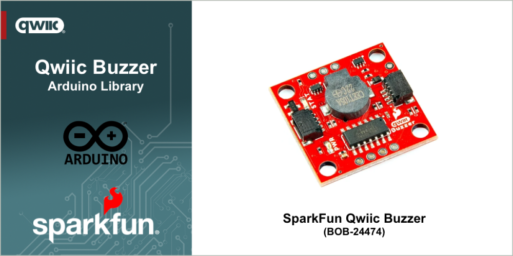

# SparkFun Qwiic Buzzer

Arduino Library for the SparkFun Qwiic Buzzer breakout board


The [SparkFun_Qwiic_Buzzer_Arduino_Library (BOB-24474)](https://www.sparkfun.com/sparkfun-qwiic-buzzer.html)  adds simple beeps and buzzes to your projects via I2C. Make some noises to alert you when something interesting (or urgent) happens. Simply connect a Qwiic cable and load up some pre-written code to an Arduino to start making noises!

The board includes an ATtiny84 with custom firmware to control the magnetic buzzer over I2C. Utilizing our handy Qwiic system, no soldering is required to connect it to the rest of your system. However, we still broke out 0.1"-spaced PTH pads if you prefer to use a breadboard to access the board's I2C, power, trigger, and reset pins on the board's edge. A 2.2k&ohm; pull-up resistor is included on the data and clock lines.

Looking for the board that matches this library - pick up a [SparkFun Qwiic Buzzer (BOB-24474)](https://www.sparkfun.com/sparkfun-qwiic-buzzer.html) at www.sparkfun.com.

## Functionality

This library provides an interface that enables the following functionality when a SparkFun Qwiic Buzzer breakout board:

* Turn the buzzer on and off
* Adjust the buzzers frequency and duration
* Control the the volume of the buzzer
* Play sound effects on the buzzer
* Change the I2C address to enable the use of multiple buzzers on one device


## General Use
The following outlines the general use of the library in an Arduino Sketch. 

### Declaration

At the start of your sketch, the library header file is included using the following statement:

~~~cpp
#include <SparkFun_Qwiic_Buzzer_Arduino_Library.h>
~~~

Before the arduino ```setup()``` function, create a Buzzer object in your file with the following declaration:

~~~c
QwiicBuzzer buzzer; // its a buzzer
~~~


### Initialization

In the Arduino ```setup()``` function, initialize the buzzer by calling the begin method. This method is called after the Arduino `Wire` (I2C) library is initialized. 

~~~cpp
//check if buzzer will connect over I2C
if (buzzer.begin() == false) {
Serial.println("Device did not connect! Freezing.");
while (1);
}
~~~

The begin method returns true if the buzzer is connected and available, and false if it is not. If a value of *false* is returned in the above example, the  sketch execution is halted.

### Usage

#### On/Off

Turn the buzzer on and off as shown in the following loop example:

~~~cpp
void loop() {
  buzzer.on();
  
  delay(1000);
  
  buzzer.off();
  
  delay(1000);
}
~~~

#### Frequency Control

The buzzer frequency is controlled using the ```configureBuzzer()``` method. 

~~~cpp
void loop() {
  // Configure with desired settings
  // Resonant frequency is 2.73KHz
  buzzer.configureBuzzer(SFE_QWIIC_BUZZER_RESONANT_FREQUENCY); 
  buzzer.on(); 
  delay(100);
  
  buzzer.off();
  delay(1000);

  buzzer.configureBuzzer(1000); // set frequency to 1KHz
  buzzer.on(); 
  delay(100);
  
  buzzer.off();
  delay(1000);
}
~~~

#### Buzz Duration

The buzz duration is set by adding a timing value after the frequency to the ```configureBuzzer()``` method.

~~~cpp
 buzzer.configureBuzzer(2730, 100); // frequency: 2.73KHz, duration: 100ms
~~~

#### Volume

The buzz volume is an additional optional parameter to the ```configureBuzzer()``` method.

~~~cpp
buzzer.configureBuzzer(2730, 100, SFE_QWIIC_BUZZER_VOLUME_MIN); // frequency: 2.73KHz, duration: 100ms, volume: MIN
...
buzzer.configureBuzzer(2730, 100, SFE_QWIIC_BUZZER_VOLUME_MAX); // frequency: 2.73KHz, duration: 100ms, volume: MAX
~~~

#### Sound Effects

The buzzer has a collection of sound effects included in this library. These are started by using the ```playSoundEffect()``` method, providing the number of the sound effect to play.

Playing sound effect 1:

~~~cpp
 err = buzzer.playSoundEffect(1, BUZZER_VOLUME);
~~~
## Examples

The following examples are provided with the library

- [Buzz](examples/Example_01_Buzz/Example_01_Buzz.ino) - This example shows how to turn the buzzer on and off.
- [Buzz Frequency](examples/Example_02_Buzz_Frequency/Example_02_Buzz_Frequency.ino) - This example shows how to adjust the frequency of the buzzer. 
- [Buzz Duration](examples/Example_03_Buzz_Duration/Example_03_Buzz_Duration.ino) - This example shows how to control the buzzer using frequency and duration.
- [Buzz Volume](examples/Example_04_Buzz_Volume/Example_04_Buzz_Volume.ino) - This example shows how to control the buzzer to sound at different volumes.
- [Change I2C Address](examples/Example_05_ChangeI2CAddress/Example_05_ChangeI2CAddress.ino) -  A configurator for changing the I2C address on the Qwiic Buzzer that walks the user through finding the address of their buzzer, and then changing it!
- [Save Settings](examples/Example_06_SaveSettings/Example_06_SaveSettings.ino) - This example shows how to save settings to the buzzer.
- [Melody](examples/Example_07_Melody/Example_07_Melody.ino) - TThis example shows how to buzz a melody on the Qwiic Buzzer.
- [Sound Effects](examples/Example_08_Sound_Effects/Example_08_Sound_Effects.ino) - This example demos the sound effects included in this library.
- [Firmware Version](examples/Example_09_FirmwareVersion/Example_09_FirmwareVersion.ino) - This example shows how to read the firmware version from the Qwiic Buzzer
- [Buzz Multiple](examples/Example_10_Buzz_Multiple/Example_10_Buzz_Multiple.ino) - This example shows how to control multiple buzzers.

## Documentation

The full API and use documentation for this library is provided [here](https://docs.sparkfun.com/SparkFun_Qwiic_Buzzer_Arduino_Library/). For a quick reference, the main methods available in the library are listed [here](https://docs.sparkfun.com/SparkFun_Qwiic_Buzzer_Arduino_Library/class_qwiic_buzzer.html).

Curious about the hardware this board works with - visit the SparkFun Qwiic Buzzer [hardware repository](https://github.com/sparkfun/SparkFun_Qwiic_Buzzer).

The ***Hookup Guide*** for the SparkFun Qwiic Buzzer is available [here](https://docs.sparkfun.com/SparkFun_Qwiic_Buzzer).

## License Information

This product is ***open source***!

This product is licensed using the [MIT Open Source License](https://opensource.org/license/mit). 


